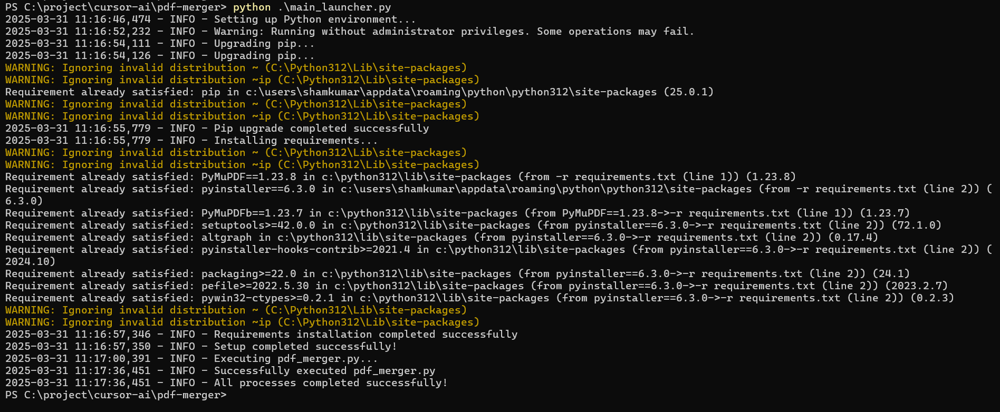

# Python Environment Setup Tool

A comprehensive tool for automatically setting up Python and its dependencies on Windows systems. This tool checks for Python and pip installation, downloads and installs them if missing, and sets up required dependencies.

## Features

- Detects Python and pip installation status
- Downloads and installs latest stable Python version if missing
- Verifies and upgrades pip installation
- Installs dependencies from requirements.txt
- Provides a user-friendly GUI interface
- Includes comprehensive logging
- Creates a standalone executable

## Building the Executable

1. Install the required dependencies:
   ```bash
   pip install -r requirements.txt
   ```

2. Build the executable using PyInstaller:
   ```bash
   pyinstaller python_setup.spec
   ```

The executable will be created in the `dist` directory.

## Usage

1. Run the executable (PythonSetupTool.exe)
2. The GUI will show current system information
3. Click "Start Setup" to begin the installation process
4. Monitor progress in the status window
5. Check the log file (python_setup.log) for detailed information

## Requirements

- Windows operating system (Windows 7 or later)
- Internet connection for downloading Python installer
- Administrator privileges for installation

## Logging

The tool creates a log file (python_setup.log) in the same directory as the executable. This file contains detailed information about the installation process and any errors that occur.

## Error Handling

The tool includes comprehensive error handling for:
- Network connectivity issues
- Installation failures
- Permission problems
- Missing dependencies
- Invalid Python installations

## Notes

- The tool requires administrator privileges to install Python system-wide
- Internet connection is required for downloading Python installer and packages
- The tool currently supports Windows only (Linux and Mac support planned for future versions)

## Run using Terminal




PS C:\project\cursor-ai\pdf-merger-tool> python .\main_launcher.py
2025-03-31 11:38:24,832 - INFO - Setting up Python environment...
2025-03-31 11:38:27,565 - INFO - Warning: Running without administrator privileges. Some operations may fail.
2025-03-31 11:38:29,410 - INFO - Upgrading pip...
2025-03-31 11:38:29,425 - INFO - Upgrading pip...
WARNING: Ignoring invalid distribution ~ (C:\Python312\Lib\site-packages)
WARNING: Ignoring invalid distribution ~ip (C:\Python312\Lib\site-packages)
Requirement already satisfied: pip in c:\users\shamkumar\appdata\roaming\python\python312\site-packages (25.0.1)
WARNING: Ignoring invalid distribution ~ (C:\Python312\Lib\site-packages)
WARNING: Ignoring invalid distribution ~ip (C:\Python312\Lib\site-packages)
2025-03-31 11:38:31,045 - INFO - Pip upgrade completed successfully
2025-03-31 11:38:31,045 - INFO - Installing requirements...
WARNING: Ignoring invalid distribution ~ (C:\Python312\Lib\site-packages)
WARNING: Ignoring invalid distribution ~ip (C:\Python312\Lib\site-packages)
Requirement already satisfied: PyMuPDF==1.23.8 in c:\python312\lib\site-packages (from -r requirements.txt (line 1)) (1.23.8)
Requirement already satisfied: pyinstaller==6.3.0 in c:\users\shamkumar\appdata\roaming\python\python312\site-packages (from -r requirements.txt (line 2)) (6.3.0)
Requirement already satisfied: PyMuPDFb==1.23.7 in c:\python312\lib\site-packages (from PyMuPDF==1.23.8->-r requirements.txt (line 1)) (1.23.7)
Requirement already satisfied: setuptools>=42.0.0 in c:\python312\lib\site-packages (from pyinstaller==6.3.0->-r requirements.txt (line 2)) (69.5.1)
Requirement already satisfied: altgraph in c:\python312\lib\site-packages (from pyinstaller==6.3.0->-r requirements.txt (line 2)) (0.17.4)
Requirement already satisfied: pyinstaller-hooks-contrib>=2021.4 in c:\python312\lib\site-packages (from pyinstaller==6.3.0->-r requirements.txt (line 2)) (2024.10)
Requirement already satisfied: packaging>=22.0 in c:\python312\lib\site-packages (from pyinstaller==6.3.0->-r requirements.txt (line 2)) (24.1)
Requirement already satisfied: pefile>=2022.5.30 in c:\python312\lib\site-packages (from pyinstaller==6.3.0->-r requirements.txt (line 2)) (2023.2.7)
Requirement already satisfied: pywin32-ctypes>=0.2.1 in c:\python312\lib\site-packages (from pyinstaller==6.3.0->-r requirements.txt (line 2)) (0.2.3)
WARNING: Ignoring invalid distribution ~ (C:\Python312\Lib\site-packages)
WARNING: Ignoring invalid distribution ~ip (C:\Python312\Lib\site-packages)
2025-03-31 11:38:32,602 - INFO - Requirements installation completed successfully
2025-03-31 11:38:32,602 - INFO - Setup completed successfully!
2025-03-31 11:38:35,320 - INFO - Executing pdf_merger.py...
2025-03-31 11:39:18,915 - INFO - Successfully executed pdf_merger.py
2025-03-31 11:39:18,915 - INFO - All processes completed successfully!
PS C:\project\cursor-ai\pdf-merger-tool>